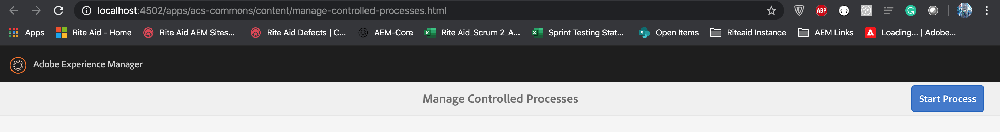
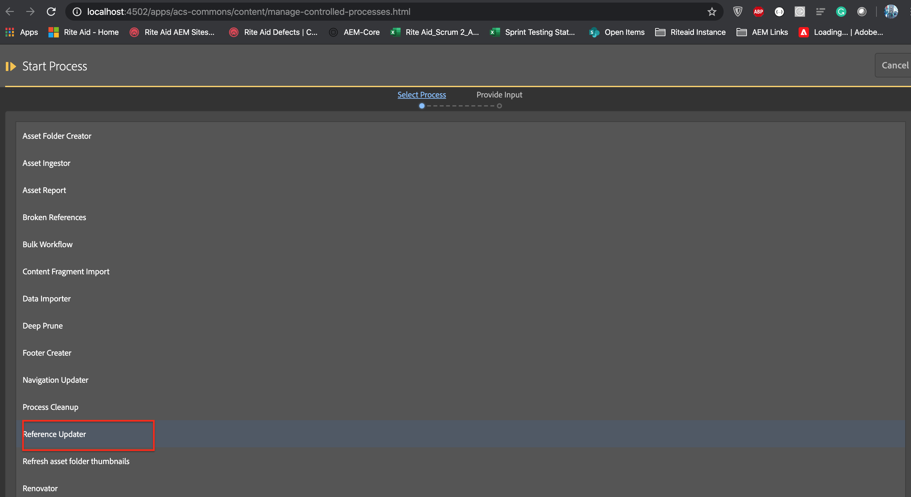
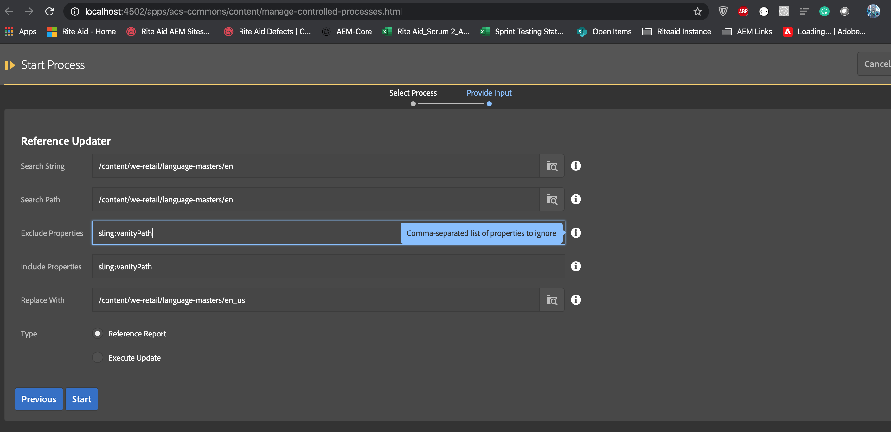

# ACS Commons MCP Reference Updator

MCP (Manage Controlled Processes) is both a dashboard for performing complex tasks and also a rich API for defining these 
tasks as process definitions. In addition to kicking off new processes, users can also monitor running tasks, retrieve 
information about completed tasks, halt work, and so on.

https://adobe-consulting-services.github.io/acs-aem-commons/features/mcp/index.html

MCP is developed on throttled scheduler concept

https://github.com/Adobe-Consulting-Services/acs-aem-commons/blob/master/bundle/src/main/java/com/adobe/acs/commons/fam/ThrottledTaskRunner.java

- Copy the Reference Updator file into package

- Make following changes to current module POM.xml

- Plugins to have `import packages` as mentioned below:

```
<plugins>
        <plugin>
            <groupId>org.apache.sling</groupId>
            <artifactId>maven-sling-plugin</artifactId>
        </plugin>
        <plugin>
            <groupId>org.apache.felix</groupId>
            <artifactId>maven-bundle-plugin</artifactId>
            <extensions>true</extensions>
            <configuration>
            <instructions>
                <Sling-Model-Packages>
                    com.example.models
                </Sling-Model-Packages>
                <Import-Package>javax.inject;version=0.0.0,
                com.adobe.acs.commons.fam;version="2.3.0",
                com.adobe.acs.commons.functions;version="1.3.0",
                com.adobe.acs.commons.mcp.model;version="3.11.0",
                com.adobe.acs.commons.mcp.form;version="2.0.0",
                com.adobe.acs.commons.util.visitors,version=2.1,
                *
                </Import-Package>
                    <Export-Package>	
                    com.deloitte.shared.*
                    </Export-Package>
            </instructions>
            </configuration>			
        </plugin>
</plugins>

Dependecies

<dependency>
    <groupId>com.adobe.acs</groupId>
    <artifactId>acs-aem-commons-bundle</artifactId>
    <version>4.0.0</version>
    <scope>provided</scope>
</dependency>
```

Make the following changes to UI Apps POM.xml

```
 <plugins>
    <!-- ====================================================================== -->
    <!-- V A U L T   P A C K A G E   P L U G I N S                              -->
    <!-- ====================================================================== -->
    <plugin>
        <groupId>org.apache.jackrabbit</groupId>
        <artifactId>filevault-package-maven-plugin</artifactId>
        <extensions>true</extensions>
        <configuration>
            <allowIndexDefinitions>true</allowIndexDefinitions>
            <group>example-commons</group>
            <subPackages>
                <subPackage>
                    <groupId>com.adobe.cq</groupId>
                    <artifactId>core.wcm.components.all</artifactId>
                    <filter>true</filter>
                </subPackage>
                <subPackage>
                    <groupId>com.adobe.acs</groupId>
                    <artifactId>acs-aem-commons-content</artifactId>
                    <filter>true</filter>
                </subPackage>
            </subPackages>
        </configuration>
    </plugin>
    <plugin>
        <groupId>com.day.jcr.vault</groupId>
        <artifactId>content-package-maven-plugin</artifactId>
        <extensions>true</extensions>
        <configuration>
            <verbose>true</verbose>
            <failOnError>true</failOnError>
        </configuration>
    </plugin>
    <plugin>
        <groupId>org.apache.sling</groupId>
        <artifactId>htl-maven-plugin</artifactId>
    </plugin>
</plugins>
```

Access the following path to Access MCP
http://localhost:4502/apps/acs-commons/content/manage-controlled-processes.html



Click on `Start Process` to Select the process



Fill all the required details



```
Provide the refernce search text                -> Any text to be searched
Provide the Search path to find the references  -> Path to search from
Comma-separated list of properties to include   -> eg: cq:template,cq:allowedTemplates,....
Comma-separated list of properties to ignore    -> eg: cq:template,cq:allowedTemplates,....
Provide the Replace String to be replace        -> Any text to be replaced
Please select the oprporiate option to execute" -> Generate Report before Exection
```

## Uses:

- Whenever we want to bulk update properties
- Whenever bulk updating text inside RTE
- Bulk Updating reference links

## Use this tool with precaution because this can introduce performance issue when run multiple times 

# Can be used to generate reports on daily basis